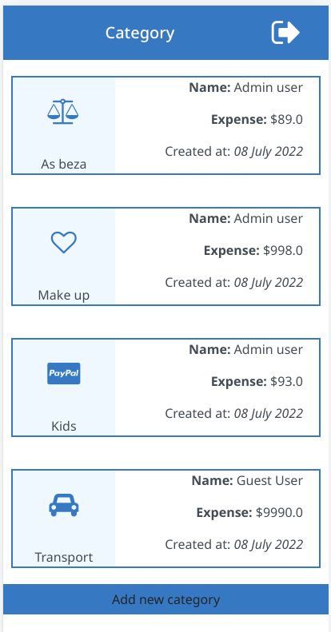
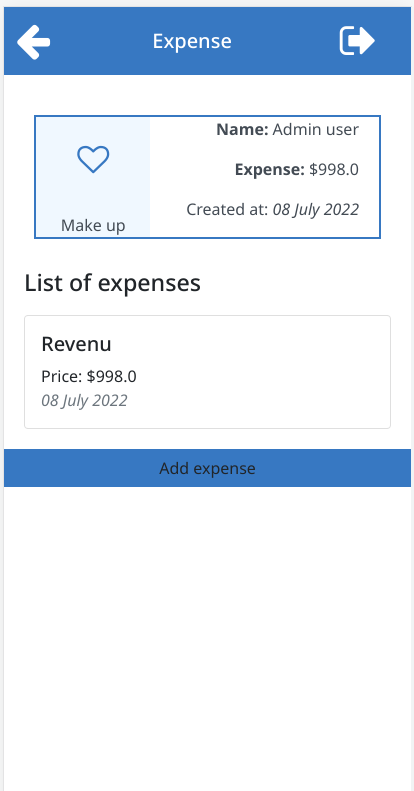
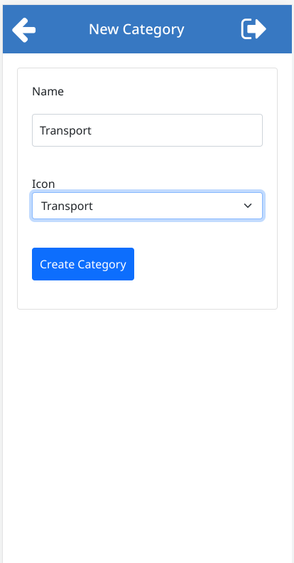
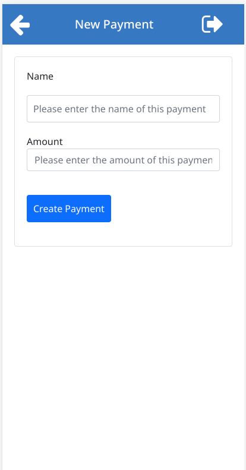

# Budget App

Budget-App is about building a mobile web application where you can manage your budget: you have a list of transactions associated with a category, so that you can see how much money you spent and on what.

# Built With
 - Ruby on Rails
 - Bootstrap 5

# presentation

- [loom link ](https://www.loom.com/share/01826d1d18be4c69bfa67a63671e3150)

# Live Demo
  - [budget-app](https://bush-budget.herokuapp.com/)

# Screenshots
     

# Additional Tools
  1. Rubocop
  2. Stylelint
  3. Ruby Gems

# Getting Started
To get local copy of the project and run

1. ``git clone https://github.com/bushmusi/budget-app.git``
2. ``cd budget-app``
3. ``gem install bundler``
4. ``bundle install``
5. ``rails s``

## Database Setup
Setup db

1. ``su - postgres``
2. ``psql``
3. ``create role budget with createdb login password 'budget'``
4. ``rails db:setup``
5. ``rails db:create``

# Tests

1. ``bundle exec rspec``
2. ``rubocop``

## Authors

👤 **Bushra Mustofa**

- GitHub: [@bushmusi](https://github.com/bushmusi)
- Twitter: [@bushera_mestofa](https://twitter.com/bushera_mestofa)
- LinkedIn: [LinkedIn](https://www.linkedin.com/in/bushra-mustofa)

## 🤝 Contributing

Contributions, issues, and feature requests are welcome!

Feel free to check the [issues page](https://github.com/bushmusi/recipe-app/issues).

## Show your support

Give a ⭐️ if you like this project!

## Acknowledgments

- Microverse: [microverse community](https://github.com/microverseinc)
- [Gregoire Vella on Behance](https://www.behance.net/gregoirevella)

## 📝 License

This project is [MIT](./MIT.md) licensed.
